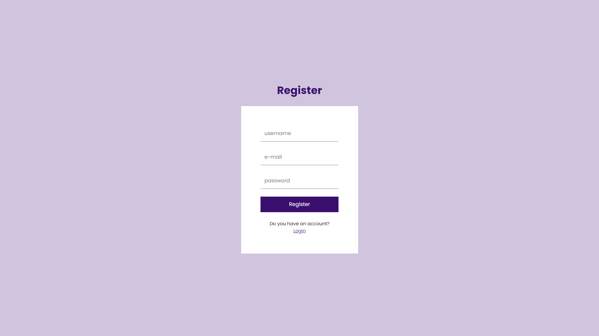
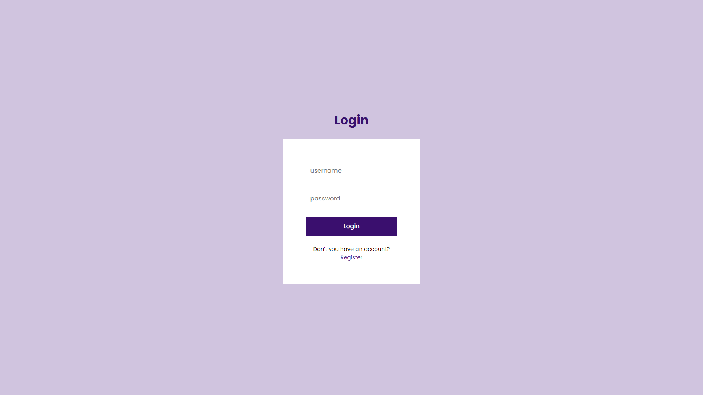
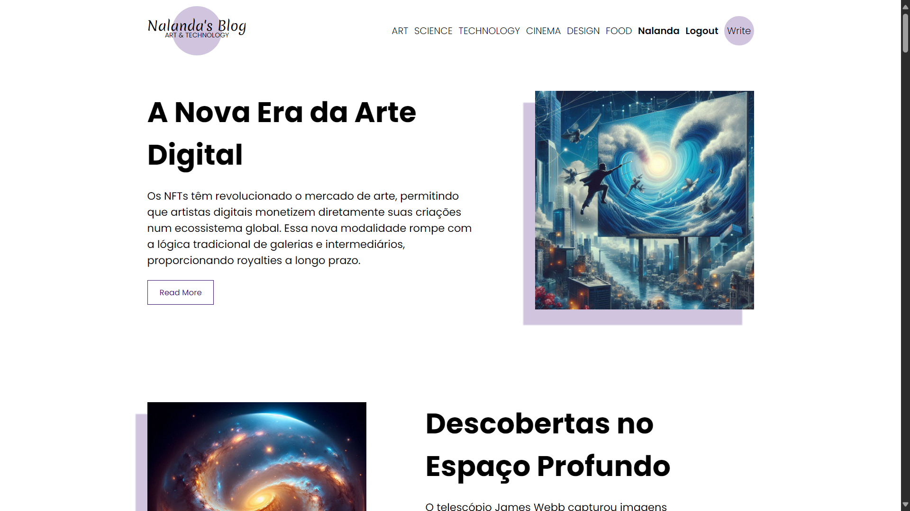
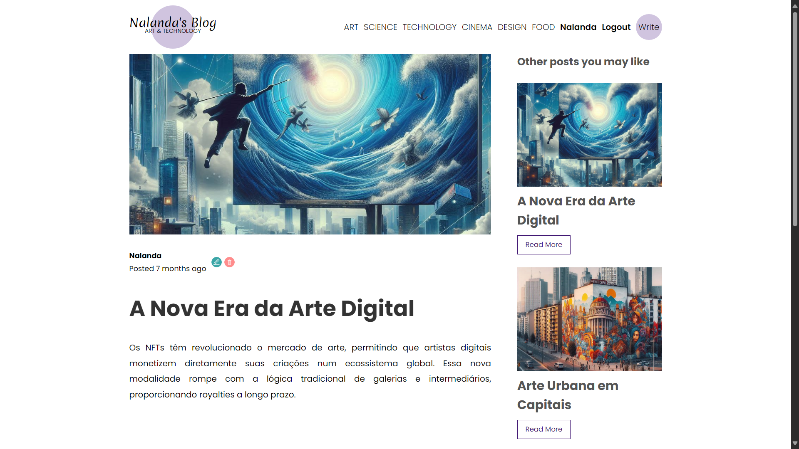
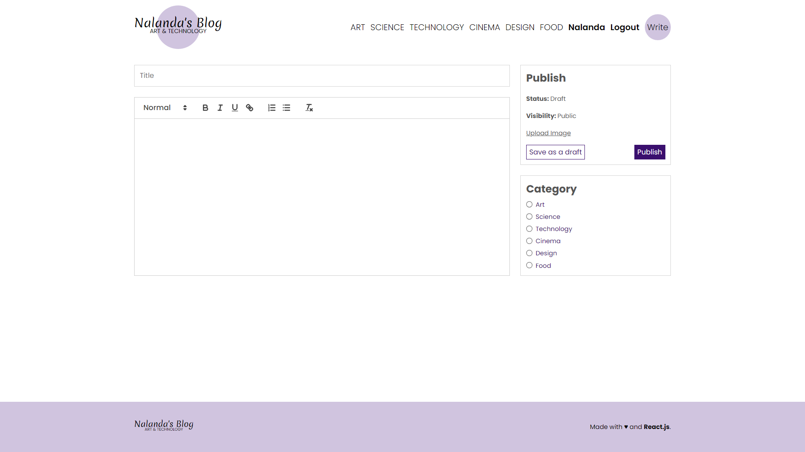

# 🌐 Projeto Blog Fullstack

Aplicação web fullstack com autenticação, CRUD de postagens, upload de imagens, responsividade e filtro por categorias. Desenvolvido com **React no front-end** e **Node.js + MySQL no back-end**.

---

## 📌 Funcionalidades

- Registro e login de usuários com senhas criptografadas (bcrypt)
- Autenticação via JWT com cookies httpOnly
- Criação, leitura, edição e exclusão de postagens
- Upload de imagens
- Filtro de postagens por categoria
- Layout totalmente responsivo (mobile, tablet e desktop)
- Backend seguro e modular
- Banco de dados relacional com MySQL
- Deploy-ready com Docker

---

## 🧪 Tecnologias Utilizadas

### 🔧 Back-end (Node.js + Express)
- Node.js
- Express
- MySQL (`mysql2/promise`)
- JWT (`jsonwebtoken`)
- Bcrypt (`bcryptjs`)
- Cookie Parser (`cookie-parser`)
- Multer (upload de arquivos)
- Docker / Docker Compose

### 🎨 Front-end (React)
- React (com hooks)
- Axios
- React Router DOM
- Context API (para autenticação global)
- CSS responsivo (Flexbox e media queries)
- Upload de imagem
- Interface inspirada em layouts modernos de blog

---

## 🚀 Como Rodar o Projeto

### 🔹 Pré-requisitos
- Node.js v18+
- MySQL rodando localmente (porta 3307)
- Docker (opcional)

### 1. Clone o repositório

```bash
git clone https://github.com/seuusuario/blog-fullstack.git
cd blog-fullstack
```

### 2. Instale as dependências do back-end

```bash
cd api
npm install
```

### 3. Configure o banco de dados

- Garanta que o MySQL esteja ativo na porta `3307`
- Edite o arquivo `api/db.js` se necessário

### 4. Crie as tabelas com o script de setup

```bash
node setup.js
```

### 5. Rode o servidor

```bash
npm start
```

### 6. Instale e rode o front-end

```bash
cd client
npm install
npm run dev
```

---

## 🧱 Sobre o Arquivo `setup.js`

O script `setup.js` automatiza a criação das tabelas `users` e `posts` no banco MySQL, com relacionamentos e constraints definidas:

- `users`: Armazena usuários com `username`, `email`, `senha` e `img`
- `posts`: Armazena posts relacionados ao usuário (`uid` como chave estrangeira)

---

## 🌐 Endpoints da API

### Autenticação
| Método | Rota                 | Descrição                |
|--------|----------------------|--------------------------|
| POST   | `/api/auth/register` | Registro de usuário      |
| POST   | `/api/auth/login`    | Login com JWT            |
| POST   | `/api/auth/logout`   | Logout e limpeza de token|

### Postagens
| Método | Rota                 | Descrição                      |
|--------|----------------------|--------------------------------|
| GET    | `/api/posts`         | Lista todos os posts           |
| GET    | `/api/posts?cat=xyz` | Lista posts por categoria      |
| GET    | `/api/posts/:id`     | Busca post único por ID        |
| POST   | `/api/posts`         | Cria um novo post (autenticado)|
| PUT    | `/api/posts/:id`     | Atualiza post do usuário logado|
| DELETE | `/api/posts/:id`     | Deleta post do usuário logado  |

### Upload
| Método | Rota          | Descrição                     |
|--------|---------------|-------------------------------|
| POST   | `/api/upload` | Upload de imagem com multer   |

---

## 📷 Imagens






---

## 👩‍💻 Desenvolvido por

**Nalanda Santos**  
[LinkedIn](https://linkedin.com/in/nalanda-santos-60b65a264) • [GitHub](https://github.com/nalandasouza)

---
