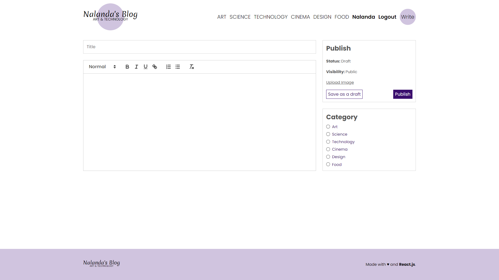

# 🌐 Projeto Blog Fullstack

Aplicação web fullstack com autenticação, CRUD de postagens, upload de imagens, responsividade e filtro por categorias. Desenvolvido com **React no front-end** e **Node.js + MySQL no back-end**.

☁️ _Deploy completo na AWS._

---

## 📌 Funcionalidades

- Registro e login de usuários com senhas criptografadas (bcrypt)
- Autenticação via JWT com cookies httpOnly
- Criação, leitura, edição e exclusão de postagens
- Upload de imagens com Multer
- Filtro de postagens por categoria
- Layout totalmente responsivo (mobile, tablet e desktop)
- SPA com React Router configurado corretamente no servidor
- Deploy na nuvem com Docker, Nginx e MySQL

---

## 🧪 Tecnologias Utilizadas

### 🔧 Back-end (Node.js + Express)

- Node.js
- Express
- MySQL (`mysql2/promise`)
- JWT (`jsonwebtoken`)
- Bcrypt (`bcryptjs`)
- Cookie Parser (`cookie-parser`)
- Multer (upload de arquivos)
- Dotenv (variáveis de ambiente)
- Docker / Docker Compose
- Reverse Proxy com Nginx

### 🎨 Front-end (React + Vite)

- React (com hooks)
- Vite
- Axios
- React Router DOM
- Context API (para autenticação global)
- CSS responsivo (Flexbox e media queries)
- Upload de imagem
- Interface inspirada em layouts modernos de blog

### ☁️ Deploy na AWS

- Front-end: hospedado com Nginx em uma VPS da AWS
  - Configurado com try_files $uri /index.html; para rotas SPA
- Back-end: rodando via Node.js, exposto por reverse proxy Nginx em `/api`

---

## 🚀 Como Rodar o Projeto

### 🔹 Pré-requisitos

- Node.js v18+
- Docker

### 1. Clone o repositório

```bash
git clone https://github.com/nalandasouza/blog-fullstack.git
cd blog-fullstack
```

### 2. Crie o arquivo `.env` no back-end (`/api`)

Preencha com as seguintes variáveis:

```dotenv
DB_HOST=localhost
DB_PORT=3306
DB_USER=root
DB_PASSWORD=password
DB_NAME=blog
JWT_SECRET=sua_chave_secreta
```

### 3. Suba o banco de dados com o Docker (`/api`)

```bash
docker compose up -d
```

### 4. Instale as dependências do back-end (`/api`)

```bash
npm install
```

### 5. Crie as tabelas com o script de setup (`/api`)

```bash
npm run setup
```

### 6. Rode o servidor (`/api`)

```bash
npm start
```

### 7. Instale e rode o front-end (`/client`)

```bash
npm install
npm run dev
```

---

## 🧱 Sobre o Arquivo `setup.js`

O script `setup.js` automatiza a criação das tabelas `users` e `posts` no banco MySQL, com relacionamentos e constraints definidas:

- `users`: Armazena usuários com `username`, `email`, `senha` e `img`
- `posts`: Armazena posts relacionados ao usuário (`uid` como chave estrangeira)

---

## 🌐 Endpoints da API

### Autenticação

| Método | Rota                 | Descrição                 |
| ------ | -------------------- | ------------------------- |
| POST   | `/api/auth/register` | Registro de usuário       |
| POST   | `/api/auth/login`    | Login com JWT             |
| POST   | `/api/auth/logout`   | Logout e limpeza de token |

### Postagens

| Método | Rota                 | Descrição                       |
| ------ | -------------------- | ------------------------------- |
| GET    | `/api/posts`         | Lista todos os posts            |
| GET    | `/api/posts?cat=xyz` | Lista posts por categoria       |
| GET    | `/api/posts/:id`     | Busca post único por ID         |
| POST   | `/api/posts`         | Cria um novo post (autenticado) |
| PUT    | `/api/posts/:id`     | Atualiza post do usuário logado |
| DELETE | `/api/posts/:id`     | Deleta post do usuário logado   |

### Upload

| Método | Rota          | Descrição                   |
| ------ | ------------- | --------------------------- |
| POST   | `/api/upload` | Upload de imagem com multer |

---

## 📷 Imagens




---

## 👩‍💻 Desenvolvido por

**Nalanda Santos**  
[LinkedIn](https://linkedin.com/in/nalanda-santos-60b65a264) • [GitHub](https://github.com/nalandasouza)

---
